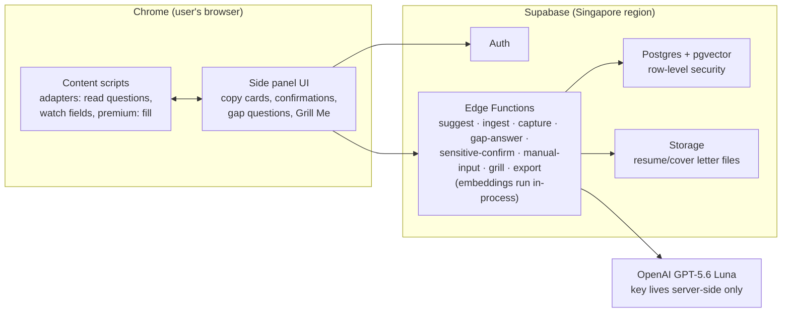

# Jobibi — Architecture

*Drafted 2026-08-09. Revised 2026-08-09 to record the outcomes of the design grill. See [DECISIONS.md](DECISIONS.md) for the decision log and [CONTEXT.md](../CONTEXT.md) for shared vocabulary.*

## Shape of the system



The extension never talks to the AI directly — every AI call goes through an Edge Function, so API keys never ship in the extension and every request is authenticated and rate-limitable per user.

## Why this stack

- **Chrome extension (Manifest V3)** — the only platform that can both *read* application forms reliably (direct DOM access, no OCR) and *write* into them (the premium Auto-Fill feature). A screen-watching desktop app could do neither well. Edge runs Chrome extensions unmodified, so Edge support is free.
- **WXT + React + TypeScript + Tailwind** — WXT is the actively maintained modern extension framework (Vite-based, hot reload, MV3-native). React drives the side panel; content scripts stay lean and framework-free.
- **Chrome Side Panel API** for the Sidekick — a docked panel that doesn't fight the job site's own CSS, with clean copy-paste ergonomics.
- **Supabase** — auth, Postgres, file storage, and server code in one vendor with a generous free tier; we already operate Supabase in production elsewhere, so the tooling is familiar. Singapore region (`ap-southeast-1`) for PH latency.
- **Postgres + pgvector** — the memory bank with meaning-based search: finds the right story from the user's history even when the question is worded differently. Hybrid retrieval (vector similarity + keyword full-text) because personal corpora are small and keyword anchors help.
- **Row-Level Security (RLS)** — per-user isolation enforced by the database on every table. The privacy claim is structural, not behavioral.
- **OpenAI GPT-5.6 Luna** for everything the model does: drafting, wording gap questions, and classification where rules don't suffice. One vendor, one SDK, one bill. Chosen for price ($0.20/$1.20 per MTok after the 30 July cut), best-in-class strict JSON schema output, ephemeral prompt caching that costs nothing while idle, and a half-price batch tier for the style-profile job. The accepted trade is that its writing voice is the least-measured of the candidates considered — see DECISIONS D5b and the risk list below.
- **Embeddings: gte-small, in-process** inside Edge Functions. Free, no network hop, and the memory bank is never sent anywhere to be embedded — only retrieved snippets leave at draft time. Its 384 dimensions are weaker than a dedicated embedding API, but on a cold-start corpus of 20–100 chunks that gap barely shows, and gate calibration dominates behaviour anyway. `memory_chunks` stores source text, so upgrading later is a batch re-embed per user rather than data loss.
- **Monorepo (pnpm):** `apps/extension` (WXT), `supabase/` (functions + migrations), `packages/shared` (types + zod schemas shared end-to-end).

## The suggestion pipeline

What happens when the user opens an application page:

1. **Extract** — the content script reads the form: question/label text, field type, surrounding context. It records a **mapping** from each question to its input field, with a confidence score. Per-site adapters for JobStreet, LinkedIn Easy Apply, and Indeed; a generic label-proximity heuristic for everything else.

2. **Establish job context** — role title and company, which is what separates a QA framing from an automation framing. Full job-description text is taken opportunistically when it happens to be in the DOM (LinkedIn Easy Apply keeps the listing behind its modal), but is never required: there are no listing-page adapters and no extra host permissions. JD-keyword targeting is a later upgrade, not a v1 dependency.

3. **Normalize** — each question is cleaned and canonicalized so "Why do you want this role?" matches its thousand phrasings. (Rules first; model assist where rules fail.)

4. **Seen-before check** — search `qa_pairs` for a near-duplicate question the user already answered. A match always surfaces, but role-match decides the presentation: same role family shows the previous answer copy-ready with a quieter "rewrite for this role"; a different role family leads with a freshly re-told draft and offers "show me what I said last time". Both options are always present, so a wrong guess costs one click.

5. **Retrieve** — hybrid search over `memory_chunks` for the top-k relevant pieces of history.

6. **Sensitive check** — runs *before* any drafting (and — since S7A — again before every later insert of user-typed text; see *Guard against sensitive text landing in ordinary memory* below). Two independent signals, and either one firing routes the question to the always-confirm path: keyword and field-type rules, and retrieval matching the question against the user's typed `sensitive_facts` entries. Union, not intersection — an unnecessary confirmation card costs one click, a miss puts a wrong salary figure into a real application. Because the four core facts are seeded at install, the retrieval signal works from the first session. Always-confirm means no drafting and no Auto-Fill, ever, at any tier.

7. **The gate** — deterministic code scores two axes and picks one of three outcomes:

   | | role-match low | role-match high |
   |---|---|---|
   | **question-match high** | **ASK** | **DRAFT** |
   | **question-match low** | REFUSE | REFUSE |

   Scoring is **relative, not absolute**: the signal is how far the top match stands above that user's own score distribution, never a fixed cosine value. Absolute thresholds mean different things for a 5-chunk user and a 200-chunk user, and gte-small's 384 dimensions make raw values noisier still. A single absolute floor sits underneath, used only to catch the genuinely-nothing case that must refuse.

   **The model is not consulted about this decision.** On a refusal it is never called at all. On an ask it is called only to *word* the gap question, after code has already decided to ask.

   Every decision is logged — both scores, the outcome, and what the user did next — because the cutoffs can only be properly calibrated against real usage.

8. **Ask, if that's the outcome** — the panel puts one short question to the user, anchored to a fact already in their history so it takes seconds to answer rather than requiring an essay. The answer is stored, chunked into memory, and the pipeline continues to drafting.

9. **Draft** — Luna writes the answer from: the style profile (cached system prompt) + retrieved snippets + the question + job context. Grounding rule in the prompt *and* enforced by the gate above it. Output length is explicitly constrained — see the verbosity note under Cost model.

10. **Render** — the model returns structured JSON against a strict schema, and the UI renders a copy card:

```json
{
  "intro": "Here's a version tailored to the QA role:",
  "answer": "…the copy-paste-ready text…",
  "skeleton": [
    "Built n8n workflow auto-triaging 200+ tickets/week",
    "Hardest part: making it reliable across malformed inputs",
    "Wrote branch-level checks against real production traffic"
  ],
  "outro": "Want it shorter or more technical?",
  "confidence": 0.86,
  "sources": [{ "kind": "qa_pair", "ref": "grab-2026-04", "label": "Your Grab application, Apr 2026" }]
}
```

The card offers the finished answer and the skeleton side by side. Copy the prose, or copy the bullets and write it yourself — which also produces the highest-quality voice material the product ever sees.

Free tier: Copy. Premium: Copy + Insert (fills the field; user still reviews and submits).

## Data model

| Table | Holds | Key columns |
|---|---|---|
| `profiles` | The user | auth id, display name, locale, tier |
| `documents` | Uploads and pasted cover letters | file ref (nullable — null for pasted text), kind (resume/cover/transcript), extracted text, parsed_at |
| `memory_chunks` | Searchable pieces of history | text, embedding, source ref, type (experience/skill/story/preference/gap_answer), freshness_at |
| `applications` | Each application the user works | company, role, site, url hash, status, submitted_at |
| `qa_pairs` | Every question the user answered | question_norm, embedding, answer_text, application_id, **draft_text**, **origin**, **edit_distance** — **the growth loop** |
| `gap_answers` | Answers to questions *Jobibi* asked | question_asked, answer_text, anchored_chunk_id, application_id, created_at |
| `sensitive_facts` | High-stakes typed facts | kind (salary/notice/visa/relocation), value, source_application_id, stated_at, confirmed_at |
| `style_profile` | Distilled voice guide | profile_md, generated_at, corpus_size |
| `gate_decisions` | Calibration telemetry | application_id, question_norm, question_match, role_match, outcome, user_action, created_at |
| `capture_mismatches` | D16 re-derive-drop audit log | application_id, question_label, original_mapping, rederived_mapping, reason, created_at |
| `extraction_failures` | Adapter extraction telemetry | adapter, host, url, url_hash, detected_fields, extracted_questions, failure_reason, created_at |

`origin` on `qa_pairs` is one of `user_written`, `user_edited`, `accepted_verbatim`. It is derived by comparing `draft_text` against what the user actually submitted, and it is what keeps the voice corpus clean (see below).

`gap_answers` is deliberately separate from `qa_pairs`: it is an answer to Jobibi's question, not an employer's, and keeping the question text lets Jobibi avoid asking the same thing twice. Its content is also chunked into `memory_chunks` so it is retrievable like any other history.

All tables RLS-scoped to the owning user. Export = one endpoint that bundles everything; delete = cascade wipe; and individual `qa_pairs` rows are deletable on their own, because Jobibi captures answers to questions it had no hand in.

## Capture — how the memory bank actually grows

The growth loop only works if Jobibi sees what the user *submitted*, not what it *offered*. Relying on a manual "I'm done" click would mean most sessions never learn anything, and "attuned after 15–20 applications" would never arrive.

So the content script keeps watching the fields it already mapped and reads their final values when the submit button is clicked or the page navigates away. This captures the user's real edits, which is the only way `origin` and `edit_distance` can be computed — and edit distance is a free per-answer quality signal that needs no callbacks and no extra clicks.

**Scope of what is read:** every field the adapter identified as an application question, including ones Jobibi didn't help with. This is deliberate. If capture were limited to fields Jobibi drafted, every refusal would be a permanent dead end — the same question refused forever, with the user's own good answer discarded. Those self-written answers are also the purest voice material in the product. Fields never identified as questions (IDs, addresses, uploads) are never read.

**Guard against silent corruption.** A broken adapter that mis-binds question #3's label to question #7's textarea produces a panel that looks entirely correct while writing the wrong answer against the wrong question — corrupting memory permanently and invisibly. So the mapping is **independently re-derived at capture time** and compared against the mapping used when the suggestion was made. Agreement writes; disagreement drops the write and logs it. Extraction failures are cheap and self-announcing; mis-mapping is expensive and self-concealing, and the design pushes failure toward the cheap kind. The same confidence signal gates Auto-Fill, which degrades to read-only rather than typing into a field it isn't sure about.

**Guard against sensitive text landing in ordinary memory.** The sensitive check (step 6) is not only a pre-drafting gate — it also runs immediately before every insert of user-typed text, in `gap-answer`, `capture`, and the refuse-card's manual-input path alike. A hit rejects that write outright and routes the user to the sensitive-confirm card; the value is never silently reclassified into `sensitive_facts` in the background, so it only ever enters that table through the one confirm/update screen (D17).

## Memory growth and the style profile

- On submit, captured answers land in `qa_pairs` with their `origin`, and new facts/stories are chunked into `memory_chunks`.
- A background job re-distills the **style profile** every N new answers. This is the concrete mechanism behind "attuned after 15–20 applications". Distillation is batch work and runs on the half-price batch tier.
- **The voice corpus is filtered by origin.** Only `user_written` and `user_edited` text trains the style profile. `accepted_verbatim` drafts remain fully searchable as *content* but are excluded from *voice* learning. Without this filter, by application 15 most of `qa_pairs` would be Jobibi's own prose, and the style profile would be distilling model tone rather than the user's — drifting further from them with every cycle while claiming to do the opposite.
- Every fact type has a freshness half-life (salary ~90 days, notice period ~90, tools/skills ~180, relocation ~180). Stale facts power **Grill Me** sessions and contextual re-confirms.

## Auto-Fill mechanics (premium)

Content script sets field values with native setters + dispatched input/change events (required for React-controlled forms). Per-site adapters own the quirks; the generic fallback attempts simple text inputs only. Sensitive fields are excluded at the pipeline level (step 6), so Auto-Fill *cannot* touch them. Low-confidence mappings disable Insert entirely. The user reviews everything before submitting — Jobibi never submits.

## Cost model (GPT-5.6 Luna, 2026-08 prices)

| | Rate per 1M tokens |
|---|---|
| Input | $0.20 |
| Output | $1.20 |
| Cached input read | $0.02 (90% off) |
| Cache write | $0.25 |
| Batch tier | 0.5× |

Per question: ~1k fresh input (question + snippets + job context) + ~1.8k cached style profile + ~300 output.

- ≈ **$0.0006 per question** → **≈ $0.012 per 20-question application**.
- Embeddings are free (gte-small runs in-process).
- Style-profile distillation runs on the batch tier at half price.

At $50/month of AI spend that is roughly 4,100 applications. **The free tier's daily cap is therefore a fairness and abuse control, not a cost control** — the original $0.20–0.30 per application estimate was an order of magnitude too high.

**Verbosity is the cost risk, not price.** Luna runs roughly twice the median output length. Since output is the dominant cost line and application fields have character limits, drafting must constrain length explicitly — via the output schema, an explicit length instruction, and a `max_tokens` cap. Left untuned, this both inflates spend and produces answers too long for the box.

## Security notes

- The model provider API key exists only in Edge Function secrets. Extension ships zero secrets.
- The provider does not train on API traffic; Asia data residency is available. Only the question, retrieved snippets, and the style profile ever leave — never another user's data.
- Extension auth: Supabase email-OTP magic-link with PKCE code exchange, completed on a dedicated extension page (`entrypoints/callback`) rather than `chrome.identity.launchWebAuthFlow` against a third-party OAuth provider — this avoids MV3's captured-webview redirect quirks. The side panel and callback page each hold their own Supabase client, sharing `chrome.storage.local` as the session store; the side panel listens for `chrome.storage.onChanged` to pick up a session written by the callback page's client.
- MV3 constraints respected: no remote code, service-worker lifecycle handled by WXT patterns.
- The read boundary (identified question fields only, never other form fields) is a product-visible commitment stated at onboarding, and the Chrome Web Store listing must describe it accurately.

## Known risks

- **Voice fidelity on the chosen model** — Luna's writing and instruction-following are the least-measured of the candidates evaluated, and voice is the product's core differentiator. Mitigation: the style profile carries more weight than originally planned, the skeleton gives users an escape hatch to their own prose, and a bake-off against real user-written answers is the trigger to reconsider.
- **ATS DOM drift** — job sites change markup; adapters break silently. Mitigation: fixture-based adapter tests, generic fallback, extraction-failure telemetry, and the re-derive-at-capture check that stops drift from corrupting memory.
- **Gate calibration** — cutoffs are tuned against a hand-built fixture before launch and against logged decisions afterward. Bias is toward *asking*: a wrong ask costs one question, a wrong draft costs trust. The ask path is itself the safety net for miscalibration.
- **Cold start** — the first application is mostly asks rather than drafts. Mitigation: anchored one-line questions, and the fact that every answer given goes straight into the form the user needed to fill anyway.
- **Output verbosity** — see Cost model. Needs active tuning, not a default.
- **MV3 service worker evictions** — state must live in storage, not memory.
